## MCP
1. Triggers: Server initiazed interactions Your server wakes the agent up
2. Streaming: Incremental tool results.No more waiting for the full payload
3. SKILLS: Resuable capabilities as on extension pattern

Vendros ---> MCP Registry ---> Consumer A. Consumer B,Consmer C

MCP ToOLS --> Context/Steering , SKILLS, Agents SOPS

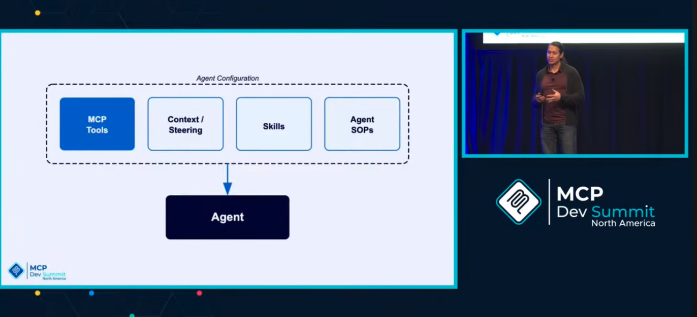

Vendros ---> AI Registry ---> Consumer A,Consumer B , Consuemr C

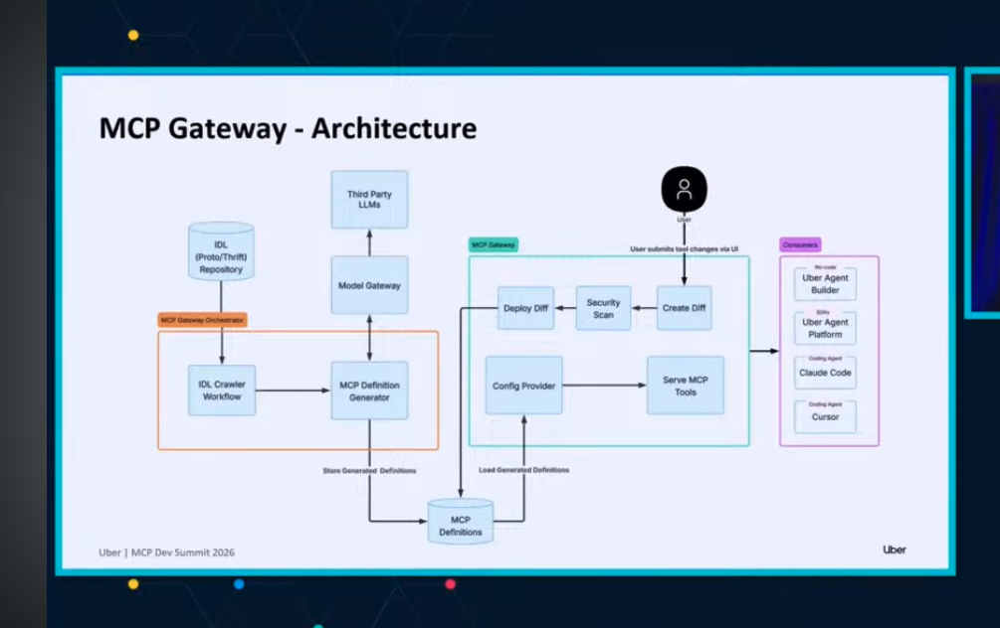

Uber Agent Builder

Uber Agent SDK

Minions, Claude Code ,Cursor 

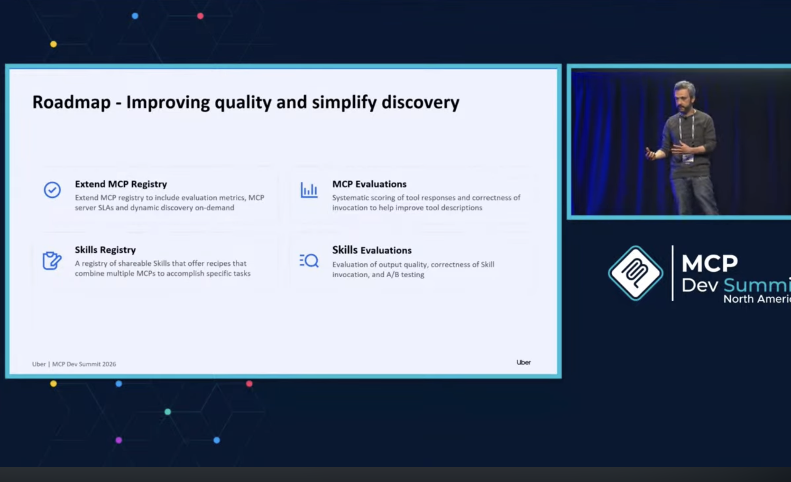

Agent Registry

MCP/Tool registry

SKILL Regostry

agent evaluations

mcp/tool evals

skill evals

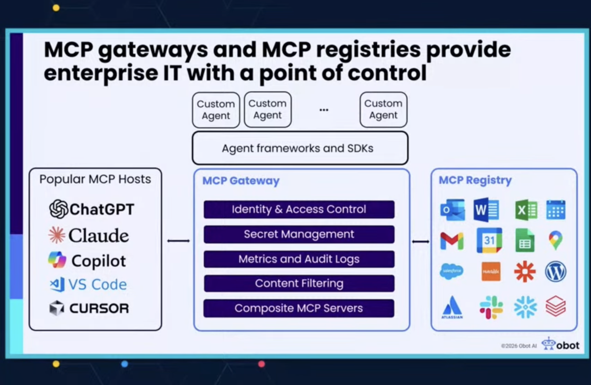

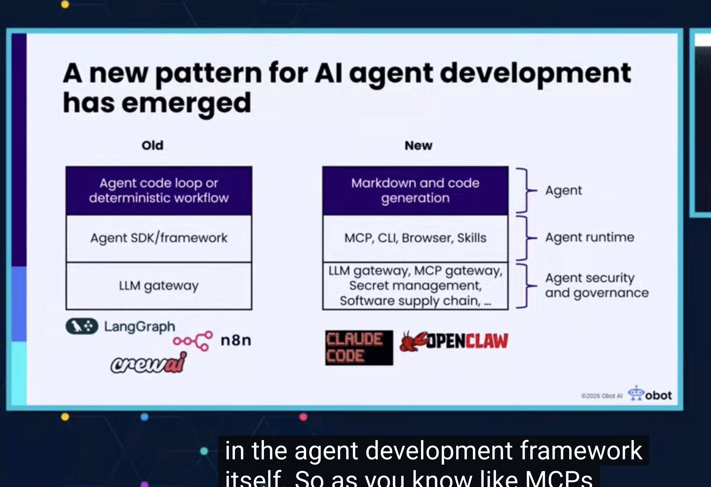

https://github.com/obot-platform/obot

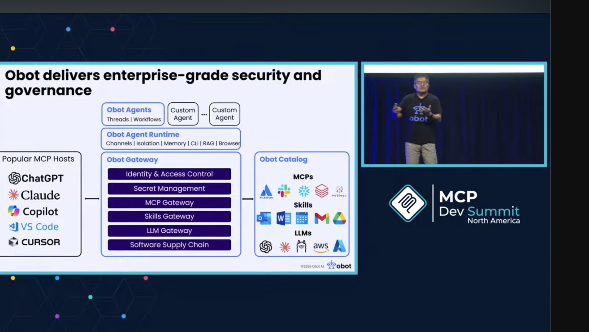

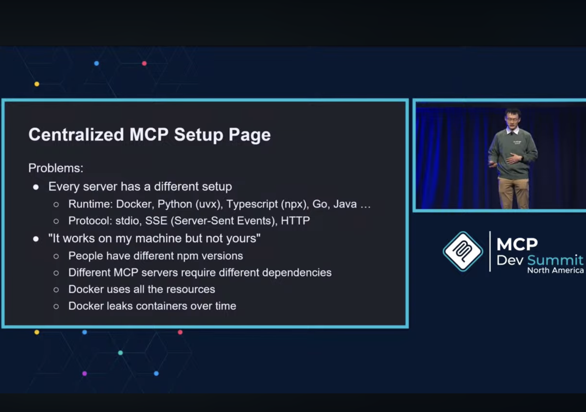

    
    
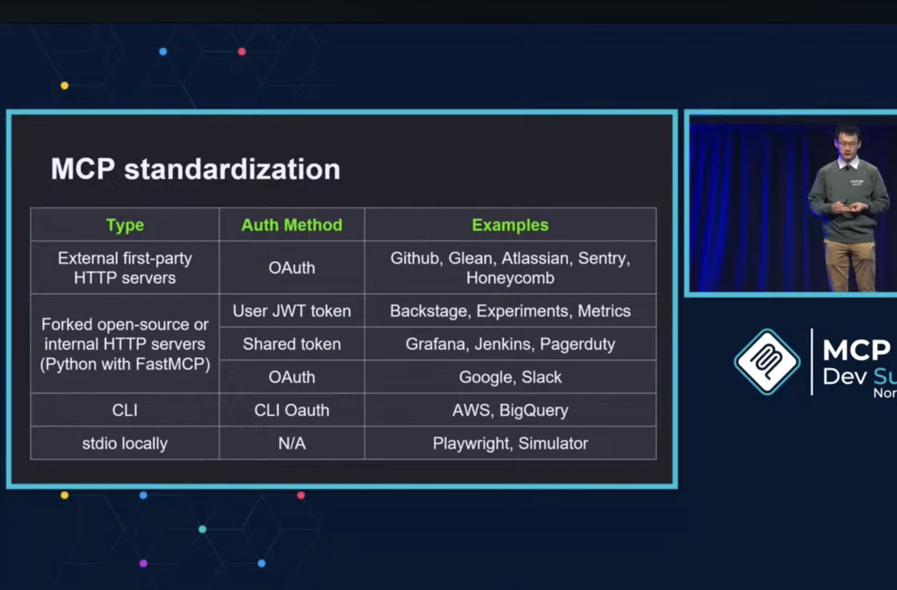

# The Reasoning Layer (LLM +MCP Client): Probabilistic
# The Control Layer (Determistic)
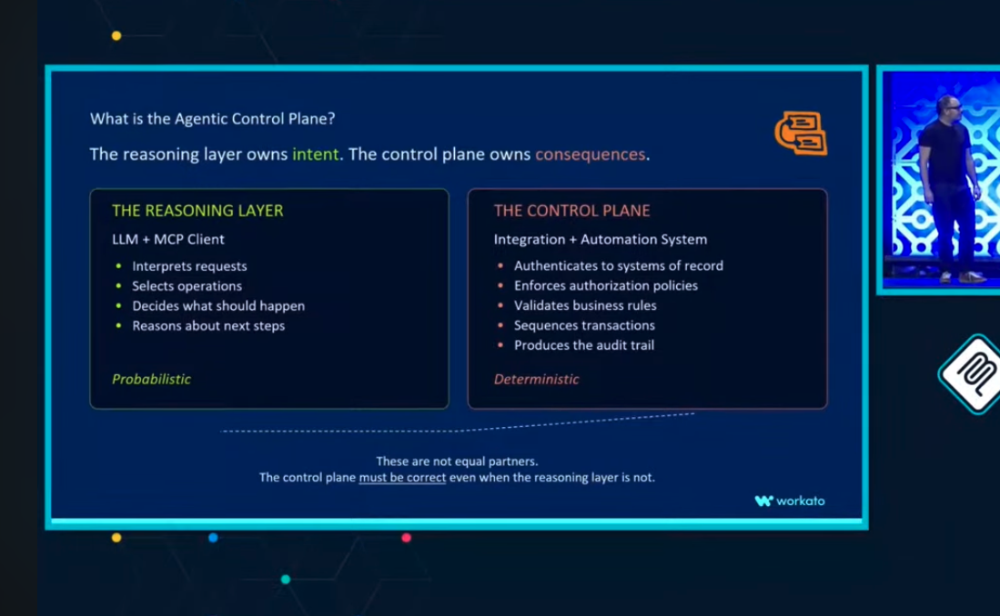

# Scaling Agents

1. Code & Agent First
2. Proactive
3. Eval + monitoring
4. Multiplayer

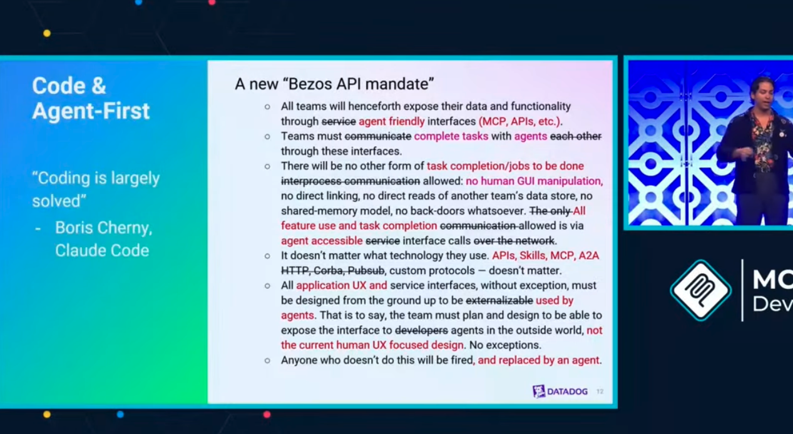

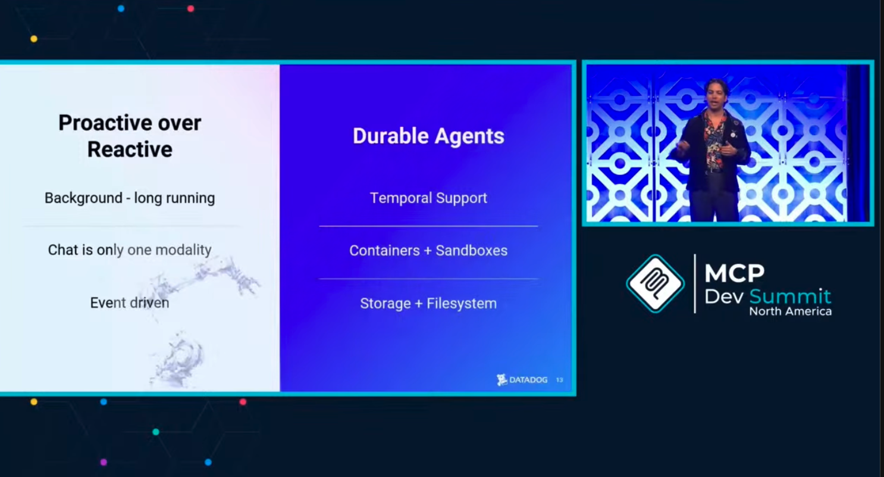